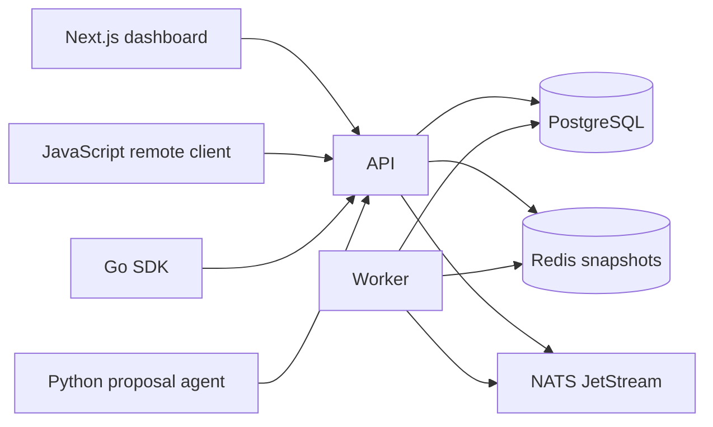

# Architecture

Switchyard is one Go module. The API and worker are process roles over the same PostgreSQL schema. Redis and NATS are disposable accelerators. The dashboard and the proposal agent do not decide flag values.

Evaluation order is kill switch, then ordered targeting, then experiment assignment, then standalone rollout, then the default. Buckets are a published SHA-256 of eight length-prefixed fields, modulo 10,000. The JavaScript client repeats that hash only to check `testdata/evaluation/golden.json`. The server returns the value.

Flag types are boolean, string, number, and JSON. Strings are JSON strings of at most 1,024 bytes. Numbers use the same bounded decimal rules as JSON numbers. Revisions are immutable. Production changes are proposals applied by a different human. The agent may submit a proposal; it cannot approve or write a flag.

Events are accepted into PostgreSQL and published through a transactional outbox. The worker folds them per user. Metric freshness is the lag between the newest accepted fact and that user's reconciliation. The measured p95 on this machine is in the benchmark report and is not the five-second target.

ADRs 0001–0012 record the decisions this diagram depends on.
