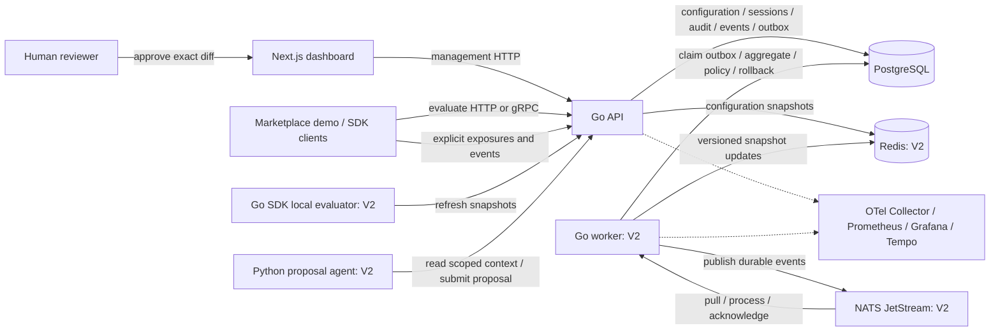

# Switchyard: proposed implementation plan

Status: **Approved by the user on 5 October 2026. Implementation is tracked in `progress.md`.**

Prepared on 5 October 2026 from your questionnaire answers. The workspace was inspected and is empty apart from this planning document. All additional choices below are proposals for your approval, not silently adopted requirements.

## 1. Outcome and scope

Build an interview portfolio and learning project for an early/mid-level experimentation backend role. The finished demo should show that you can explain deterministic assignment, SQL transactions, concurrency, event delivery, caching consistency, measurement, operational failure, and controlled automation.

Use one Go codebase and PostgreSQL schema. Introduce a separately runnable Go worker only when background work is needed. API and worker share domain packages and release together; they are process roles in a modular monolith. Next.js supplies the dashboard and a small marketplace listing-flow demo. One on-demand Python agent submits proposals through the API.

**MVP:** HTTP API, PostgreSQL, boolean/JSON flags, targeting, deterministic A/B assignment, exposures and events, basic experiment results, RBAC, audit history, Next.js dashboard, tests, Docker setup.

**V2:** Redis snapshots, NATS JetStream and event workers, gRPC and Go SDK, manual/scheduled/metric-driven rollouts, kill switch and automatic rollback, telemetry, repeatable load tests, governed AI proposals, string/number flags, small JavaScript SDK, portfolio documentation.

**Deferred beyond V2:** hosted deployment, Kubernetes, Terraform, multi-organization tenancy, mutual-exclusion groups, enterprise SSO, mobile SDKs, multi-region operation, service mesh, billing, advanced causal inference. Hosted deployment gets a separate cost proposal; the $10–20/month budget is not a promise that every local service can be hosted together at that price.

## 2. Proposed decisions to approve

| Topic | Proposed choice | Reason |
|---|---|---|
| Go HTTP | Standard `net/http`, explicit handlers and middleware | Learn Go directly and keep dependencies modest. |
| Database | `pgx`, parameterized handwritten SQL, numbered SQL migrations | Make transactions, indexes, and query plans visible; no ORM or generic repository framework. |
| Authentication | Email/password, bcrypt password hashes, opaque database sessions, HttpOnly cookies | Credible small application auth without enterprise identity integration. Development credentials are explicitly opt-in. |
| Authorization | Organization role plus project membership; permissions checked against the project and environment | Viewer reads; developer edits development/staging and proposes production changes; admin approves production changes. |
| Application credentials | Hashed project/environment-scoped API keys, separate evaluate/event/config-read permissions | Dashboard sessions and application credentials have different jobs. |
| Production control | Reviewed proposals for production configuration changes; only validated traffic decreases and explicit safe-value disable/rollback are exempt | One central mutation policy prevents bypass through targeting/default/value edits. MVP production is read-only until M9. |
| Bucketing | SHA-256 over unambiguous, length-prefixed inputs; two independent salts for eligibility and variant | Stable across processes and languages; Go map iteration never affects outcomes. |
| Redis | Cache compiled project/environment configuration snapshots, not individual user decisions | Avoid high-cardinality cache entries and attribute-dependent stale decisions. |
| NATS | File-backed JetStream, durable pull consumer, bounded batches | Restart durability and controlled processing concurrency. |
| Delivery | PostgreSQL outbox plus idempotent consumers | Accepted events and configuration changes are durable before publication. |
| SDK | Shared pure Go evaluator; remote HTTP/gRPC mode and cached local snapshot mode | One set of assignment semantics and useful offline behavior. |
| UI | Next.js/TypeScript, compact tables/forms/results charts, no separate frontend business rules | Backend engineering remains the focus. |
| AI | Python CLI with Pydantic proposals, deterministic mock and replaceable hosted adapter | Runs without keys; Go owns all enforcement. |
| Observability | Structured Go logs from the start; Prometheus, Grafana, OTel Collector and Tempo in optional profile | Metrics and inspectable traces, without forcing the full stack onto an 8 GB laptop every day. |
| Workflow | Local Git milestones first; GitHub Actions when a remote exists | There is no repository yet and the currently configured GitHub CLI login is unavailable. Local progress does not depend on GitHub. |

Dependencies and container images will be pinned to compatible stable versions during foundation setup; no `latest` image tags. Exact versions will be recorded in the repository and updated deliberately.

### Proposed initial settings

These are tunable engineering defaults to approve with the plan, not scientifically established thresholds.

| Setting | Initial proposal |
|---|---|
| Snapshot refresh / maximum stale age | Refresh every 2 seconds; use a cached snapshot for no more than 30 seconds after its last successful authoritative refresh. |
| Healthy kill-switch propagation | Target p99 ≤5 seconds across API and SDK clients; up to 30 seconds during disconnection before safe fallback. |
| Raw events / aggregates | 7 days / 90 days for demo data; configurable. Raw replay is limited to those 7 days; older finalized summaries are not fully rebuildable. |
| Replay / duplicate identities | Maximum replay age 7 days; identity/consumer receipts retained 8 days. Older replay is rejected; age gates prevent expired identities being reused. |
| Conversion attribution | First explicit exposure per user and experiment run; listing completion within 30 minutes. |
| Late arrivals | Accept arrivals up to 24 hours late; quarantine older or implausibly future-dated events. |
| Metrics freshness | Target p95 ≤5 seconds at the 1,000 events/sec workload. |
| Safety checks | Every 10 seconds; 5-minute operational window; at least 1,000 eligible requests per evaluated variant; two consecutive breaches. |
| Demo operational thresholds | Error rate >2% or listing-request p95 >500 ms. Thresholds are configurable per environment/experiment. |
| Conversion rollback | Compare completed cohorts only; at least 1,000 matured exposed users per variant; ≥20% relative decline vs. control across two checks. |
| AI/human rollout policy | Maximum increase of 10 percentage points per proposal; exact schedule/automatic progression ceiling approved in advance. |
| Sensitive attributes | Default denylist includes email, phone, name, address and payment identifiers; attribute names/schema allowlisting also supported. |
| Approval freshness | Approval expires after 24 hours; any changed base revision invalidates it. |
| Benchmark fixtures | 100 flags, 10 experiments, 100,000 synthetic users, 1 million seeded events; publish exact achieved dataset and hardware. |

Each flag/environment defines both a normal default and an explicit typed emergency safe value. SDK setup requires a declared safe fallback, matching the known emergency value for that flag/environment; reject known mismatches as configuration errors. Unknown flags return an error with the application's declared safe fallback. No universal `false` default is silently substituted for JSON or other types. Business safety of a chosen value requires human review; the evaluator can enforce types and consistency, not infer whether a value is safe.

## 3. Architecture



**Management flow:** authenticate → validate → authorize → apply proposal policy where required → compare revision → transactionally save configuration revision and audit record → add outbox record in V2. Approval is authorization for an exact change; validation is repeated at application time.

**Evaluation flow:** resolve credentials and scope → load snapshot → evaluate pure rules/buckets → return typed value, reason, configuration revision, experiment run, variant and decision ID. Evaluation does not automatically create exposure or write to PostgreSQL per user.

**MVP events:** validate authenticated batch → transactionally insert unique raw events → return acknowledgement after commit. Metrics are derived by SQL from raw events; there is no background queue yet.

**V2 events:** validate → transactionally insert unique raw events and corresponding outbox records → return accepted acknowledgement → worker publishes to JetStream → consumer updates aggregates and its deduplication marker in one PostgreSQL transaction → acknowledge after commit. Publish duplicates and redeliveries are expected; there is no claim of exactly-once end-to-end transport.

JetStream supplies persistent streams and at-least-once delivery; application transactions still control duplicate effects. See [NATS JetStream](https://docs.nats.io/reference/2.12/jetstream) and [pull consumers](https://docs.nats.io/learn/jetstream/pull-consumers).

## 4. Behavioral contracts

### Evaluation and experiment lifecycle

Order: **kill switch → ordered explicit targeting rules → experiment eligibility and variant → standalone rollout → configured default**. A kill switch or safety rollback returns the environment's emergency safe value for every user, ahead of targeting. Exhausted snapshot freshness returns the SDK's explicitly configured safe fallback, with an error/reason. A targeted override is not counted in randomized experiment results unless a later design explicitly supports it. The demo's emergency safe value and noneligible default route to the control listing flow.

Rules are ordered and limited to typed equality, membership, and numeric comparison initially. Missing/type-mismatched attributes do not match. No scripting engine, arbitrary expressions, or user-supplied regex execution.

Use 10,000 integer buckets: `eligible = eligibility_bucket < traffic_basis_points`; variant assignment uses a different stable salt and fixed weight boundaries. For example, increasing traffic from 10% to 20% preserves every previously eligible user's variant. Reducing to 10% removes users outside that eligibility boundary without reshuffling remaining users.

Hash input is a versioned sequence of length-prefixed UTF-8 fields: algorithm version, project ID, environment ID, flag ID, experiment-run ID (or a stable standalone rollout salt), purpose (`eligibility` or `variant`), fixed salt, and exact stable user ID. Interpret the first eight SHA-256 bytes as an unsigned big-endian integer and reduce modulo 10,000. Sort variants by their immutable ordinal before cumulative-weight selection. Never include traffic percentage, current configuration revision, or Go map iteration order. Publish these details and golden vectors before building another-language client.

Active experiment variant IDs, treatment values, weights, salts and randomized eligibility/targeting definitions are immutable. Changing 50/50 to 70/30, a treatment's JSON payload, or the target population requires pausing/completing the old run and creating a new run and analysis population. Traffic percentage changes alone retain the run's assignment definition. Pre-existing explicit overrides remain ahead of assignment and outside the randomized population. One active experiment can attach to a flag/environment; users may participate in experiments on other flags. A future nullable exclusion-group reference can be added without implementing an unused subsystem now.

States: draft → running → paused or completed; safety failure → rolled_back. Restarting a rolled-back production run requires approval, and changed weights require a new run. Recorded outcomes remain tied to their original run and revision.

### Measurement correctness

Evaluation and exposure are distinct. The marketplace demo emits exposure only when the selected listing flow is actually shown, then emits completion and request-outcome events carrying the exposure/run/variant context. Application event keys are trusted server-side credentials; evaluation responses are not public proof of assignment.

Unique event ID is scoped by project/environment. Reusing an ID with a different payload returns a conflict rather than silently accepting changed data. Also deduplicate business conversion by user/run so generating new event IDs cannot count the same user's listing completion repeatedly.

The earliest valid event-time exposure anchors assignment for that run; ties break by event ID. Repeated displays do not increase the user denominator. Conversion attribution uses event time and a 30-minute window. Events arriving before their exposure remain pending and are reconciled when exposure arrives. An earlier late exposure triggers deterministic recomputation of that user's contribution, subtracting any prior contribution before adding its replacement; per-user/run row locking serializes this change. Conflicting reported variants are checked against the immutable run assignment and quarantined when invalid. A finalized conversion cohort waits through the attribution window and configured lateness allowance. Live/provisional numbers remain visibly distinguished from finalized cohorts.

Keep raw facts for 7 days and finalized aggregate summaries for 90 days. Rebuild only the raw-retained reporting interval; preserve older summaries instead of claiming they can be recomputed. Before raw deletion, reconcile eligible attribution and ensure finalized summaries exist. Consumer receipts and accepted event identities outlive the supported replay horizon. Unsupported older events/replays are rejected or quarantined, never counted as new events after deduplication state expires.

Results are segmented by experiment run, environment and variant. Show numerator, denominator, absolute/relative lift, Wilson 95% confidence intervals per conversion rate, and a two-proportion test when sample assumptions are met. Return “insufficient data” for unsupported samples. A/A fixtures, known outcomes and sample-ratio mismatch checks catch broken instrumentation. Significance is a descriptive fixed-analysis output; repeatedly watching a dashboard is not a sequentially valid stopping rule. Safety rollback uses explicit operational policies, not a dashboard p-value.

Latency is based on listing-operation request samples with fixed histogram boundaries and a documented approximate p95. Do not confuse platform API latency with the product experiment's latency guardrail. Relative conversion policies need a concurrent valid control and matured cohorts; otherwise defer that check.

### Caching and failure

Redis is disposable. PostgreSQL stores immutable revisions and authoritative current-version pointers. Cache writers apply only monotonically newer revisions; delayed workers cannot restore an older enabled configuration over a newer kill switch. API in-memory snapshots and SDK snapshots replace atomically, never mutate while readers evaluate.

Refresh from PostgreSQL when Redis is missing/stale, using a bounded refresh coordinator to avoid a cache-miss storm. Snapshots carry the last authoritative verification time; receiving a cached payload from Redis or an API intermediary cannot grant another freshness window. Check expiry locally with bounded clock-skew tolerance. Notifications may accelerate propagation but periodic revision verification provides repair. Persisted SDK snapshots do not renew freshness merely because a process restarted.

“Immediate kill switch” means an immediate authoritative disable with bounded distributed propagation; an offline client cannot receive an instantaneous update. After maximum stale age, the SDK returns its safe fallback. Monitor propagation delay and demonstrate both healthy and disconnected behavior.

Redis documents the speed benefit and invalidation requirement of local caching; our initial implementation uses explicit snapshot versions and polling rather than a complex tracking integration. See [Redis client-side caching](https://redis.io/docs/latest/develop/clients/client-side-caching/).

Events acknowledged as accepted are committed to PostgreSQL. During a NATS outage, the bounded outbox can recover after restart; beyond configured storage/backlog limits, return retryable 503 with no false acceptance. Invalid input is not retryable; rate/backpressure limits use 429 or 503 with Retry-After. Clients retry with the same IDs. Retry queues, consumer concurrency and dead-letter retention are bounded.

### Approval, scheduling and AI boundaries

V2 proposals contain typed operations, target environment, base revision, rationale, proposer, policy result and exact diff. States: proposed → validated → approved → applied, or rejected/expired/stale. Human approval cannot bypass validation, forbidden attributes, role checks or conflicting revisions.

An AI request is attributed to the requesting human; a second human admin must approve their production proposal. Seed two distinct demo humans to demonstrate this. The agent has context-read and proposal-submit permissions only, no database credentials and no apply endpoint permission. Hosted-provider output is untrusted JSON; Go validates the same schema and policy regardless of proposer.

Until M9 introduces approval, production configuration is read-only: MVP launches and edits occur in development/staging. At M9, all production configuration mutations go through a central command/policy boundary, including flag creation, targeting, defaults, treatment values and re-enablement, not just the rollout endpoint. A validated decrease in traffic or explicit emergency safe-value disable/rollback is exempt from review. Emergency action cancels scheduled progression, records the measured evidence and enters a cooldown. Re-enablement is a separate reviewed change.

Scheduled and metric-driven progression uses an approved plan containing exact steps, maximum percentage, checks, expiry and base configuration. A worker may execute only authorized steps; conflicting edits invalidate the plan. After an approved step, the plan records the expected successor revision. Changing steps or raising the ceiling requires fresh approval. Progression and rollback serialize on the same run/environment row. A safety rollback re-reads the latest applicable state after a conflict, instead of being discarded as a stale ordinary proposal; in one transaction it disables to the safe value, cancels steps, advances revision and records evidence. A progression that gets the lock afterward must see the safety state and stop. Test both transaction orderings and worker retries.

## 5. Folder structure

Create folders only when their milestone needs them. This is the intended final layout, not a request to create empty scaffolding everywhere.

```text
switchyard/
├── cmd/
│   ├── api/main.go
│   ├── worker/main.go
│   └── seed/main.go
├── internal/
│   ├── auth/                    # sessions, roles, project membership, app keys
│   ├── projects/                # projects and environments
│   ├── flags/                   # definitions, revisions, targeting
│   ├── experiments/             # runs, lifecycle, allocations
│   ├── events/                  # validation, ingestion, attribution
│   ├── metrics/                 # SQL results, aggregates, simple statistics
│   ├── rollouts/                # schedule, guardrails, safety transitions
│   ├── proposals/               # human/AI validation, approval, application
│   ├── audit/                   # append-only application history
│   ├── transport/http/         # REST handlers, middleware, errors
│   ├── transport/grpc/         # evaluation transport only initially
│   ├── platform/
│   │   ├── config/
│   │   ├── postgres/
│   │   ├── cache/
│   │   ├── messaging/
│   │   └── telemetry/
│   └── jobs/                    # outbox, aggregation, schedules, cleanup
├── pkg/evaluation/              # pure typed evaluator shared with Go SDK
├── sdk/go/                      # clients, snapshot refresh, typed fallbacks
├── sdk/javascript/              # small remote SDK late in V2
├── api/
│   ├── openapi.yaml
│   └── proto/switchyard/v1/evaluation.proto
├── migrations/
├── web/                         # dashboard + isolated marketplace demo route
├── agent/
│   ├── switchyard_agent/        # CLI, schema, mock, provider adapters
│   ├── tests/
│   └── pyproject.toml
├── tests/
│   ├── integration/
│   ├── e2e/
│   └── fixtures/
├── loadtest/                    # k6 workloads + benchmark datasets
├── deploy/
│   ├── docker/
│   └── observability/           # Collector, Prometheus, Grafana, Tempo
├── docs/
│   ├── architecture.md
│   ├── adr/
│   ├── local-development.md
│   ├── benchmark-report.md
│   ├── interview-walkthrough.md
│   ├── demo-script.md
│   └── implementation-plan.md
├── .github/workflows/ci.yml
├── compose.yaml
├── Makefile
├── .env.example
├── go.mod
├── go.sum
└── README.md
```

Inside a domain module, start with `service.go`, types/validation, its PostgreSQL queries and tests. Introduce small interfaces only at actual boundaries such as clock, snapshot store and event publisher. Dependencies point toward domain logic; domain services never import HTTP/gRPC handlers. Use explicit constructor wiring rather than a dependency-injection container.

## 6. Data and API map

Add tables incrementally:

- Foundation: users, sessions, projects, project_memberships, environments, application_keys, audit_entries.
- Flags/experiments: flags, flag_revisions, environment_flag_state, experiments, experiment_runs, variants. Immutable revision content may contain validated targeting JSON; identity, status and foreign keys remain relational.
- Events: raw_events, exposure/attribution state introduced as measurement requires it. Index project/environment, run/user and event-time query paths. MVP metrics derive facts from raw events.
- V2: outbox, consumer_receipts, metric_buckets, rollout_plans/steps, guardrail_checks, proposals/approvals. Cohort state and request histograms serve different counting units.

Enforce unique flag keys within projects, explicit environment foreign keys, allocation totals and valid transitions. Audit records include actor, source, request ID, environment, before/after revision, reason and timestamp. Application credentials cannot alter/delete audit records; this is application-level append-only history, not a cryptographically tamper-proof archive.

REST surface: sessions, projects/environments, flags/revisions, experiments/runs, `POST /v1/evaluate`, `POST /v1/events:batch`, metrics/results, audit, snapshots, rollout plans and proposals. gRPC initially exposes Evaluate/EvaluateBatch; management remains REST. OpenAPI and protobuf contracts evolve at the milestone that introduces each capability.

## 7. Exact implementation order and milestone gates

The dependency chain is **M1 → M2 → M3 → M4 → M5 → M6 → M7 → M8 → M9 → M10 → M11 → M12**. Work serially so each lesson builds on functioning software. Milestones may contain several small commits; they are not twelve giant pull requests.

### M1 — Foundation and runnable local stack

**Context:** Empty workspace; establish a real Go application before business features.

**Build order:** (1) Create `switchyard`, initialize Git and copy this approved plan. (2) Pin tool/image versions; create Go module, configuration and Makefile. (3) Add API lifecycle, structured logs, request IDs, timeouts, liveness/readiness and graceful shutdown. (4) Add PostgreSQL, migrations and Compose. (5) Add local checks and GitHub Actions definition without requiring a remote.

**Exit criteria:** One documented command starts API/PostgreSQL; health and database readiness differ correctly; migrations work from an empty database; termination closes servers/pools; secrets are excluded from Git. Base Docker services work on ARM64.

**Verify:** `make test`, `make vet`, `make smoke`, `docker compose config`; start/stop and database-unavailable smoke checks. CI runs the same Go checks.

**Learning:** Go packages, errors, context cancellation, HTTP lifecycle, connection pools.

**Estimated effort:** 12–18 hours. **Rollback:** revert foundation commits and preserve the plan; no external state.

### M2 — Projects, authentication, permissions and audit

**Context:** A running API and database; every later operation must have a scoped actor.

**Build order:** (1) Migrations for identity/project/environment/audit. (2) Password/session login and opt-in demo seeds. (3) Project membership and role checks. (4) Scoped application keys. (5) Transactional audit recording for all configuration changes.

**Exit criteria:** Viewer cannot mutate; developer cannot edit another project; admin permissions are explicit; environment credentials cannot cross scope. MVP production management is read-only even for admins. Login cookies and state-changing session requests have CSRF protection; invalid/login abuse has bounded rate limits. Failed or rolled-back writes do not create successful-change audit entries. No credentials appear in logs.

**Verify:** `make test`, `make integration`, `make race`; authorization matrix, session expiry and audit atomicity tests.

**Learning:** Explicit interfaces, SQL transactions and security boundaries; avoid re-teaching familiar REST basics.

**Estimated effort:** 16–24 hours. **Rollback:** revert code; development migrations roll back only where safe, otherwise use forward repair.

### M3 — Flags and a pure deterministic evaluator

**Context:** Scoped identities and transactions exist. Define assignment behavior before optimizing it.

**Build order:** (1) Typed boolean/JSON definitions and immutable revisions. (2) Ordered attribute rules and explicit defaults. (3) Pure hashing/eligibility/weighted assignment functions with golden vectors. (4) HTTP evaluation and management handlers. (5) Optimistic revision conflicts and evaluation reason metadata.

**Exit criteria:** Repeated evaluation is identical across process restarts; rules honor precedence; typed safe values/fallbacks work, including JSON and an accidentally enabled mismatched fallback; 10% eligibility is a subset of 20%; increasing/decreasing traffic preserves remaining assignments. Golden vectors define cross-language behavior. Missing user ID or invalid weights never silently create random assignment. Evaluation performs no per-user database write.

**Verify:** `make test`, `make integration`, `make race`, `make fuzz-smoke`; property tests for monotonic membership, allocation boundaries, malformed rules and deterministic replay. Record initial Go evaluator benchmarks.

**Learning:** Value types, table-driven tests, deterministic encoding and fuzzing.

**Estimated effort:** 20–28 hours. **Rollback:** restore prior authoritative flag revision; use forward data repair rather than deleting audit history.

### M4 — A/B lifecycle, explicit events and basic results

**Context:** Flags can be evaluated consistently; now measure a real randomized population.

**Build order:** (1) A/B run lifecycle on one flag/environment and immutable active weights. (2) Explicit exposure and conversion/request schemas. (3) Bounded batch ingestion, payload identity conflicts and deduplication. (4) SQL attribution and results including pending late events. (5) Conversion intervals/tests, data sufficiency and sample-ratio warnings.

**Exit criteria:** Known synthetic fixtures produce exact exposure/conversion counts; unexposed or targeted override users are excluded; retrying/reordering events does not change final metrics; historical results remain attached to their run. Transactions never acknowledge an uncommitted event. Provisional and finalized results are labeled.

**Verify:** `make test`, `make integration`, `make race`; A/A fixture, duplicate/new-ID conversion tests, missing/late exposures in both arrival orders, contribution corrections, conflicting variants, frozen treatment edits, revision/run changes and confidence-interval reference cases.

**Learning:** Idempotency, SQL indexes, event-time attribution and measurement limitations.

**Estimated effort:** 24–36 hours. **Rollback:** pause a run; preserve raw facts and regenerate derived views after a fix.

### M5 — Dashboard and marketplace demo: MVP release

**Context:** End-to-end backend behavior exists; the interface should make it inspectable.

**Build order:** (1) Login/project/environment navigation. (2) Flag editing, evaluation preview and audit screen. (3) Experiment creation/start/pause and results. (4) Minimal listing-flow demo showing control/treatment with explicit exposure. (5) Seed dataset and clean-machine local guide.

**Exit criteria:** A reviewer can log in, create a flag, target a user, launch an A/B test in development/staging, complete demo listings, see counts and inspect audit history. Read-only roles behave correctly. Production is visibly read-only until approval controls are introduced. Backend returns all authoritative decisions and errors.

**Verify:** Go checks plus `make web-check` and `make e2e`; browser journey from seeded login to result/audit. Start from fresh Compose volumes once to verify documented setup.

**Learning:** Only backend/frontend contract issues; keep Next.js explanation concise.

**Estimated effort:** 18–28 hours. **Rollback:** revert UI commits; backend and recorded events remain usable. Tag the working local state `v0.1.0-mvp`.

### M6 — Redis snapshots and bounded stale evaluation

**Context:** MVP is correct; optimize configuration reads rather than inventing user-result caching.

**Build order:** (1) Versioned compiled snapshots and Redis Compose service. (2) In-memory read-only snapshots and bounded refresh. (3) Monotonic cache writes and authoritative reconciliation. (4) Kill-switch evaluation precedence and healthy propagation. (5) Cache hit/miss/staleness counters and Redis outage drills.

**Exit criteria:** Redis deletion/restart repairs from PostgreSQL; concurrent cache misses have bounded database load; an old cache writer cannot overwrite a newer disable; stale snapshots expire into configured fallback. No user attributes are part of unbounded cache keys.

**Verify:** `make integration`, `make race`, `make cache-drill`, evaluator benchmarks; delayed-write and offline refresh tests using an injected clock.

**Learning:** Concurrency, immutable snapshots, synchronization, cache-aside failure and bounded staleness.

**Estimated effort:** 18–28 hours. **Rollback:** use PostgreSQL-backed snapshot loading; no source-of-truth data lives only in Redis.

### M7 — Durable events and Go worker

**Context:** Event schemas and raw storage already exist. Change processing without changing accepted facts.

**Build order:** (1) PostgreSQL outbox on event/configuration transactions and `cmd/worker`. (2) File-backed JetStream with publisher acknowledgements. (3) Durable pull consumer with bounded batches and commit-before-ack. (4) Idempotent aggregate/attribution updates and late-event reconciliation. (5) Retry/dead-letter/replay controls and retention cleanup. (6) Compare new aggregates to MVP SQL as a correctness oracle before switching reads.

**Exit criteria:** Stop/restart NATS/worker without losing acknowledged events; duplicates and crash-after-commit leave aggregates unchanged; outbox publication recovers after an ambiguous acknowledgement; permanent failures are inspectable and reprocessable. Raw replay reconstructs only the raw-retained interval, leaving older finalized summaries intact. Expired replay cannot bypass deduplication. Metrics freshness meets the stated target or measured limits are documented before further optimization.

**Verify:** `make integration`, `make race`, `make event-drill`, `make aggregation-parity`; crash points, out-of-order cache updates, redelivery and bounded-backlog tests. First 1,000 events/sec ingestion trial records achieved lag and resource use.

**Learning:** At-least-once delivery, transaction boundaries, backpressure, worker cancellation and recovery.

**Estimated effort:** 28–42 hours. **Rollback:** switch metrics reads to raw-event SQL; keep outbox/raw data for replay. Do not purge queues to hide a failure.

### M8 — gRPC and Go SDK

**Context:** A stable shared evaluator and reliable snapshots exist; offer client integration without duplicated semantics.

**Build order:** (1) Versioned protobuf Evaluate/EvaluateBatch contract and generated code. (2) gRPC adapter calling the same service. (3) Go SDK remote mode with deadlines/typed defaults. (4) Cached local snapshot mode, atomic refresh and shutdown. (5) Exposure/event helper with explicit delivery acknowledgement, bounded buffering and stable retry IDs. (6) A tiny Go example integrates the listing experiment.

**Exit criteria:** HTTP, gRPC and SDK return matching values/variants/reasons for golden fixtures. Local reads are race-free during refresh; unavailable server produces last-known-good behavior only within its allowed age, then default. SDK does not silently promise durable events from an in-memory buffer; applications see delivery status and may persist IDs themselves.

**Verify:** `make test`, `make race`, `make integration`, `make sdk-contract`, local SDK benchmark. Test a disconnected API intermediary serving stale snapshots without extending SDK freshness. Measure cached local p99 against the <10 ms goal separately from network RPC latency.

**Learning:** Go API design, protobuf contracts, deadlines, goroutine ownership and caller-controlled lifecycle.

**Estimated effort:** 18–28 hours. **Rollback:** HTTP remains available; SDK remote mode remains usable if local caching needs repair.

### M9 — Approvals, scheduled rollout and automatic rollback

**Context:** Correct metrics and bounded configuration propagation exist. Add control loops only now.

**Build order:** (1) Shared proposal/approval records for human production rollout changes. (2) Multi-variant UI and manual percentage changes using stable eligibility. (3) Approved scheduled steps with injected clock and row/revision checks. (4) Operational/error/latency/conversion guardrails with minimum data and freshness checks. (5) Rollback transaction, schedule cancellation, cooldown and evidence. (6) Approved metric-driven progression within a fixed ceiling; reviewer UI and broken-treatment demo.

**Exit criteria:** No production mutation endpoint can bypass the central approval policy; emergency reduction is allowed and audited. Stale/conflicting schedules stop; worker restart cannot repeat a step; concurrent progression and rollback cannot leave an enabled successor in either lock ordering. Insufficient/stale metrics cannot promote a rollout. A deliberately broken treatment triggers operational rollback to the safe value, cancellation, audit evidence and bounded API/SDK propagation. Conversion checks wait for matured cohorts; demonstrate those with an injected clock/historical fixtures because the 24-hour lateness allowance prevents immediate conversion finalization.

**Verify:** `make integration`, `make race`, `make rollout-drill`; duplicate ticks, two-worker race, stale proposal, traffic decrease, disabled-state precedence and approval expiry tests.

**Learning:** State machines, transactional compare-and-swap, distributed job ownership and policy tradeoffs.

**Estimated effort:** 28–42 hours. **Rollback:** disable progression, reduce to safe state, retain approval/evidence history; never automatically restart a rolled-back run.

### M10 — Observability and measured performance

**Context:** The key operational behaviors work; now make their performance and failures visible.

**Build order:** (1) OTel traces for API, PostgreSQL, outbox and consumer paths with async context propagation. (2) Prometheus metrics and bounded labels. (3) Optional Collector/Prometheus/Grafana/Tempo profile and dashboards. (4) k6 arrival-rate evaluation and event workloads; separate local Go benchmarks. (5) Failure/recovery, mixed-workload and soak runs. (6) Profile CPU/memory/SQL, make measured optimizations and publish before/after results.

**Exit criteria:** A trace follows an accepted event through processing; dashboards show latency, errors, cache staleness, outbox age, consumer lag, rollback and resource use. No user IDs/event IDs become metric labels. Evaluation benchmark attempts 10,000 requests/sec honestly; ingestion attempts 1,000 events/sec separately and concurrently. Publish achieved throughput, p50/p95/p99, error rate, dropped load-generator iterations, correctness checks, propagation/freshness, CPU/RAM and recovery time. Failing a target is a documented finding, not a rewritten benchmark.

**Verify:** `make observability-smoke`, `make load-evaluation`, `make load-events`, `make load-mixed`, `make load-soak`, `make failure-drills`. See the benchmark protocol below for load-generator limits.

**Learning:** Traces vs. metrics, SLO-style targets, profiling and saturation diagnosis.

**Estimated effort:** 20–30 hours. **Rollback:** disable the optional telemetry profile/exporters; preserve raw benchmark evidence.

### M11 — Governed Python agent

**Context:** Human approval and application already exist. AI only creates an additional proposal source.

**Build order:** (1) Versioned proposal JSON schema and Python CLI. (2) Deterministic mock suggestions from a scoped summary. (3) Read/propose-only application identity and requesting-human attribution. (4) Go structural/semantic/policy checks and exact reviewer diff. (5) Idempotent transactional application with repeated validation. (6) Replaceable hosted adapter, with no provider selected or API key required until you choose one.

**Exit criteria:** A mock proposes a useful listing experiment or rollout change; invalid allocations/sensitive targeting/oversized increases fail; a different human approves production changes; expired or stale approval fails. Direct agent mutation requests receive denial. Repeated apply requests create one change/audit outcome. Adversarial model output cannot change policy or permissions. No automatic model invocation occurs.

**Verify:** `make agent-test`, `make integration`, `make e2e`; valid proposal path plus same-person approval, stale revision, forbidden operation, malformed output, and duplicate apply cases.

**Learning:** Explain the Go enforcement boundary; keep familiar Python/agent concepts brief.

**Estimated effort:** 16–24 hours. **Rollback:** disable agent credentials/provider; ordinary human control remains available.

### M12 — Polished V2 and interview package

**Context:** All core reliability and governance features are demonstrated. Finish the portfolio without expanding infrastructure scope.

**Build order:** (1) String/number flag support and tiny JavaScript remote SDK against shared golden fixtures. (2) Finalize accessible dashboard states and multi-variant results. (3) Clean-machine Docker/ARM64 test, pinned dependency/image review and full CI definition. (4) Architecture diagram and concise ADRs. (5) Benchmark report, operations guide, interview walkthrough and 5–8 minute demo. (6) Review exit criteria and tag `v0.2.0`.

**Exit criteria:** A reviewer can reproduce setup, run the marketplace experiment, witness rollback, reject/approve an AI proposal, inspect audit/telemetry and rerun benchmarks. Documentation accurately states measured limits. Every included subsystem has a demonstrable purpose. Hosted deployment is not required to declare local V2 complete.

**Verify:** `make check`, `make integration`, `make race`, `make e2e`, `make agent-test`, all relevant failure drills and a clean demo rehearsal. Re-run full load tests only if final changes affect their measured path.

**Learning:** Interview reasoning: alternatives, limits, observed failures and the next justified scaling step.

**Estimated effort:** 16–24 hours. **Rollback:** revert presentation/SDK additions independently; retain the validated backend release.

## 8. Testing and benchmarking protocol

Makefile targets named above are contracts to implement with each milestone, not existing commands. `make check` combines formatting verification, vet, unit tests and language checks; integration/race/browser/load targets are separate so everyday development stays light.

Testing layers:

1. Pure unit/property/golden tests for bucketing, validation, policies, intervals and state transitions. Fuzz hostile input and encoding boundaries.
2. PostgreSQL integration tests on isolated schemas/databases for constraints, authorization, atomic writes, audit and attribution.
3. Redis/NATS tests only once those dependencies exist: redelivery, restart, lost notification, delayed writer and outbox replay.
4. Race detector around refresh, worker lifecycle, shared evaluator and SDK shutdown; no unbounded goroutine-per-event design.
5. A few browser journeys for flag/experiment creation, outcomes and proposal approval, rather than duplicating every backend test in the browser.

Performance measurements must distinguish **pure local evaluations/sec**, **HTTP requests/sec**, **gRPC requests/sec**, **events/sec**, and **batch requests/sec**. Batch size 100 does not make 10,000 events/sec equal 10,000 HTTP requests/sec.

Proposed runs: warmup → 5-minute stepped rates → 10-minute steady target → 30-minute soak at a sustainable rate; repeat meaningful results three times. Include cold cache, warm cache, Redis outage, worker backlog recovery, rule-heavy flags, changing users and concurrent ingestion. Local Go benchmarks use allocation reporting. Measure generator CPU and dropped iterations; if the M1 laptop saturates, document that or use a separately approved runner.

Use k6 constant-arrival/ramping-arrival-rate workloads to avoid request production slowing invisibly when responses get slower. This follows the distinction in [k6 open and closed load models](https://grafana.com/docs/k6/latest/using-k6/scenarios/concepts/open-vs-closed/). Proposed performance targets: <0.1% unexpected failures, p99 <50 ms for warm HTTP/gRPC evaluation at achieved sustained rate, and p95 metrics freshness ≤5 seconds at 1,000 events/sec. Benchmark completion requires a reproducible report even when a performance target fails. Correct assignment/counts, committed acceptance, durable recovery and bounded failure remain mandatory correctness gates; performance shortfalls are documented with cause and measured sustainable capacity.

Publish Docker CPU/memory limits, host RAM, dependency versions, commit SHA, exact commands, flags/rules/event shapes, dataset size, observation profile on/off, raw outputs and correctness reconciliation. Do not compare a no-network Go microbenchmark to another system's end-to-end API throughput.

## 9. Local operation and resource budget

MVP default Compose: PostgreSQL + API + dashboard. V2 default adds Redis + NATS + one worker. Python runs on demand; k6 runs in a separate load profile. Observability is optional and includes a trace backend, not an exporter with nowhere to inspect traces. The [OTel Collector](https://opentelemetry.io/docs/collector/) provides a vendor-neutral receiving/processing/exporting boundary.

Initial budgets to validate: API 256 MB, worker 384 MB, PostgreSQL 768 MB, Redis 128 MB, NATS 256 MB, built dashboard 384 MB. These are starting limits, not measured usage. Target ≤3 GB for the built core stack and ≤4.5 GB with observability; keep development Next.js on the host if its build/runtime pushes memory higher. Set actual Redis/NATS storage/backlog limits and measure disk growth. Persist PostgreSQL/JetStream in named volumes. Normal shutdown never deletes them.

CI: formatting, vet, unit tests, race tests, language checks and isolated PostgreSQL integration; V2 adds scoped Redis/NATS integration. Browser and heavier fault tests can be separate jobs. Full load tests run explicitly, not on every push or an undersized shared runner. Publishing a GitHub repository, hosted model selection and deployment remain separate actions once needed.

## 10. Documentation, learning and workflow

Keep approximately six concise ADRs: modular monolith; deterministic bucketing and immutable allocation; PostgreSQL/outbox/idempotency; bounded-stale snapshots; metrics/guardrail limitations; approval and AI trust boundary. Add another only for a consequential new tradeoff.

Each working session starts from the approved milestone and ends with: what changed, why it was chosen, what tests showed, and the next build step. Explain Go/concurrency/Redis/NATS in context; do not reproduce a full language tutorial or familiar Next.js/REST material.

Each implementation checkpoint is a small local commit with relevant passing tests. When GitHub is ready, use short branches and reviewable PRs; a PR is optional until a remote exists. Create release tags only after milestone gates pass. For destructive schema changes, preserve raw data and prefer a corrective forward migration over claiming every migration can safely go down.

Estimated effort is **234–352 focused hours**, including targeted explanations and tests, before unforeseen rework. At 10–15 hours/week this is approximately **16–36 weeks**. MVP is roughly **90–134 hours** (6–14 weeks); reassess after M3 using actual progress. These are planning estimates, not deadlines.

If a step changes, record the reason, affected dependencies, revised acceptance criteria and effort in `docs/implementation-plan.md`. Routine fixes stay within the approved milestone. Changes to product behavior, scope, budget or approval policy return to you for a concrete decision. No parallel implementation agents are needed; the planning skill requests one independent review of this plan.

## 11. Final approval gate

Approve this plan as written, or identify changes to the proposed choices/settings. Approval authorizes starting **M1** in `/Users/rohitrajsaji/Desktop/Mercari/switchyard` and building with you in this order. It does not authorize deployment, paid services, a hosted model purchase, or changes to your external accounts.

No application implementation, repository initialization, dependency installation or infrastructure startup occurs until you approve.
